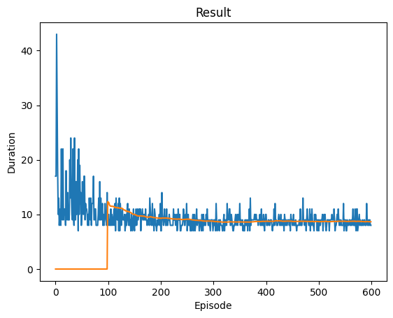
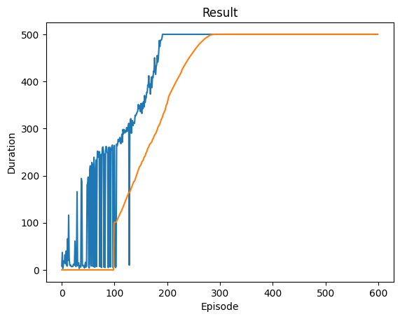

# DRL-DeepQNetwork-training-failures-summarise
This repository analyzes several possible reasons for leading false positive training in DQN with CartPole (gymnasium). \
**Briefly speaking**, the best way to figure out your script falls into the false positive case rather than false configuration or misunderstanding in DQN mechanisms is to **train a pre-trained** model in the same case.
The influential factors are: 
* [penalty reward](https://github.com/gasaiginko/Deep-Reinforcement-Learning-with-Deep-Q-Network--a-simple-implementation#different-penalty-reward-configurations-contribution-to-training-results): not clearly distinguished from the normal reward
* [learning rate](https://github.com/gasaiginko/Deep-Reinforcement-Learning-with-Deep-Q-Network--a-simple-implementation#learning-rate-is-significant-to-the-training-time-for-achieving-an-acceptable-model): not enough training episodes
* [batch size](https://github.com/gasaiginko/Deep-Reinforcement-Learning-with-Deep-Q-Network--a-simple-implementation#large-batch-size-can-stabilize-the-result): too small -> unstable
* [clamp value](https://github.com/gasaiginko/Deep-Reinforcement-Learning-with-Deep-Q-Network--a-simple-implementation#clamp-gradient-can-lead-to-a-stable-training-process-and-better-results)

## Concepts
* False positive training: the model converges to a low reward value due to non-fine-tuned hyperparameter settings, like this: \
 
* Target Model (/Policy/network): the model that generates temporal difference target (TD target, or target Q value: r + Q(s_(t+1))), almost with froze parameter (for stabilization and convergence speed).
* Action Model (/Policy/network) or Policy_Net: the model that is updating frequently with stepping.
* Q: estimation value to a given state (or station-action pair).

## DQN is sensitive to hyperparameter settings and can be skewed easily:
* Batch Size and learning Rate's influences: [DeepReinforcementLearning_DQN_Test.ipynb](DeepReinforcementLearning_DQN_Test.ipynb)
* If the model is not instructed in the proper direction, it's highly possible to be led into false positive: \
  For the same hyperparameters configuration, as shown in [Nov_05_2024_DQN_test.ipynb](Nov_05_2024_DQN_test.ipynb): \
  Model initialized randomly: \
   \
  Model initialized with pre-trained parameters ([DQN_official.pt](DQN_official.pt) from [pytorch](https://pytorch.org/tutorials/intermediate/reinforcement_q_learning.html)) with skewed reward (terminated reward (penalty) value 0 -> -5): \
   \
  Thus a well configuration is required for training from random initialization!

## Env specification: [gymnasium/cartpole_v1](https://gymnasium.farama.org/environments/classic_control/cart_pole/) 
Reward: 1 -> stay in 'balanced' threshold; 0 -> termination (out of 'balanced threshold') \

## Different penalty reward configurations' contribution to training results:
Batch size 4, Learning rate 1e-2, termination penalty: 0, clamp threshold: (-1,1) \
 \
Batch size 4, learning rate 1e-2, termination penalty: -15, clamp threshold: (-1,1) \

## Learning rate is significant to the training time for achieving an acceptable model: 
A large learning rate can visualize results faster. \
Batch size 4, learning rate 1e-2, termination penalty: -15, clamp threshold: (-1,1) -> fit at 250 ep \
 \
Same configuration with changing learning rate to 1e-3 -> fit at 300 ep \
 \
Same configuration with changing learning rate to 1e-4 -> fit at 850 ep \

## Large Batch size can stabilize the result: 

With different batch sizes {4,32,128,256} under the same hyperparameter configuration: \

## Clamp gradient can lead to a stable training process and better results: 
(Gradient) clamp: enforce the values of gradients to exist in a specific range. Exp.: lambda g: max(min(g, max_value), min_value) \
With different clamp abs(thresholds): {1, 100, inf}: \

## Conclusion:
The best configuration for this cart-pole-v1 environment is: 
    
    bs: 256
    lr:1e-3
    penalty reward: -15
    clamp value: [-1,1]

## My Question: 
Why does DRL display a sudden period of convergence and then a sudden overfitting in this experiment, unlike training computer vision models? \
-- In value-based methods, we use an aggressive operator to change the value function: we take the maximum over Q-estimates. Consequently, the action probabilities may change dramatically for an arbitrarily small change in the estimated action values if that change results in a different action having the maximal value. (from [huggingface-DRL](https://huggingface.co/learn/deep-rl-course/en/unit4/advantages-disadvantages))

Reference: 
1. [Pytorch Implementation](https://pytorch.org/tutorials/intermediate/reinforcement_q_learning.html#training)
2. [Tensorflow Implementation GreeksForGreeks](https://www.geeksforgeeks.org/a-beginners-guide-to-deep-reinforcement-learning/)
3. [A simple introduction of deep reinforcement learning](https://aws.amazon.com/what-is/reinforcement-learning/#:~:text=Reinforcement%20learning%20(RL)%20is%20a,use%20to%20achieve%20their%20goals.)
4. A survey article may help with further studying: [Deep Reinforcement Learning: A Survey](https://ieeexplore.ieee.org/document/9904958)
5. An implementation of DRL from one of my known professors: [Optimizing Data Center Energy Efficiency via Event-Driven Deep Reinforcement Learning](https://ieeexplore.ieee.org/document/9729602)
6. Effable explanation of special operator asterisk *: https://stackoverflow.com/questions/19339/transpose-unzip-function-inverse-of-zip/19343#19343
7. Map() function: https://www.geeksforgeeks.org/python-map-function/
8. Lambda() function: https://www.geeksforgeeks.org/how-to-use-if-else-elif-in-python-lambda-functions/

Detailed explanations are inside the [DeepReinforcementLearning_DQN_Test.ipynb](https://github.com/TyBruceChen/Deep-Reinforcement-Learning-with-Deep-Q-Network--a-simple-implementation/blob/main/DeepReinforcementLearning_DQN_Test.ipynb) file.
